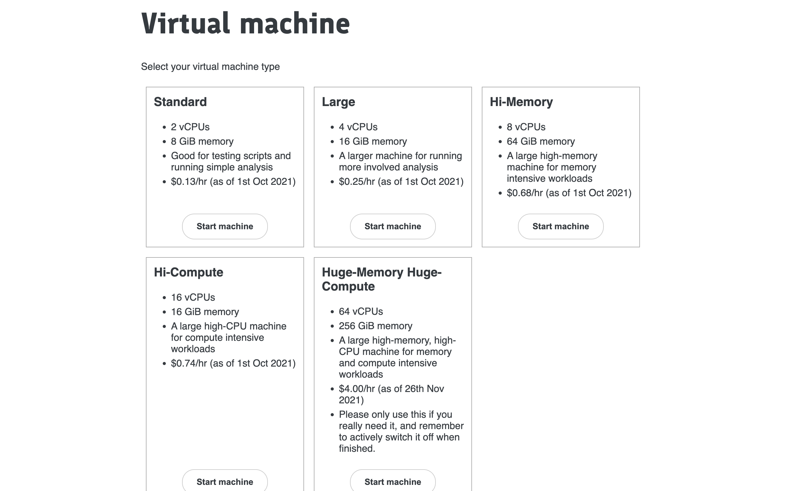

Having selected your [_username@genesandhealth.qmul.ac.uk_](mailto:username@genesandhealth.qmul.ac.uk) account as your Chrome Profile, point your Chrome browser to:

[https://qmul-production.genesandhealth.qmul.ac.uk/](https://qmul-production.genesandhealth.qmul.ac.uk/)

This will take you to the TRE login page. You will be asked to enter your username and password. The username is the one you have been given by the Genes and Health team, and the password is the one you have set up when you first logged in.

If you want to go a specific sandbox, you can use the following URL, and replace the sandbox number with the one you want to access:

[https://qmul-production.genesandhealth.qmul.ac.uk/fg-qmul-production-sandbox-1/vm](https://qmul-production.genesandhealth.qmul.ac.uk/fg-qmul-production-sandbox-1/vm)

## Choosing your ivm !

Once you have logged in, you will be taken to the **Virtual Machines** page. Here you can start a new ivm, or connect to an existing one.

You will be offered a variety of virtual machine (ivm) types. Choose the **Standard** one. We suggest only using the other types ( **which cost more!** ) if there is a need for executing particular script that uses high memory or requires increased CPU capacity, and only once you have tested your script works on the Standard machine. 

Note that there are a few ivm types with lots of CPUs - these can be good for multithreaded applications such as plink or regenie that can make full use of these - sometimes these applications can run input/output too fast for the standard google bucket storage, and you might need to copy key files to local faster storage (see below).

## Switching off the ivm 

Your virtual machine will keep running for 48 hours if you are doing nothing. You can disconnect from Chrome, turn your laptop off, and then you will be straight back into the exact same ivm when you connect again (within 48h). If you have linux jobs running, the ivm will keep going while these run (however long) plus another 48h.

Keeping ivms running in the background costs money. So **please actively shutdown (if you don't need the extra 48h) using the little off button on the bottom of the side menu.**
