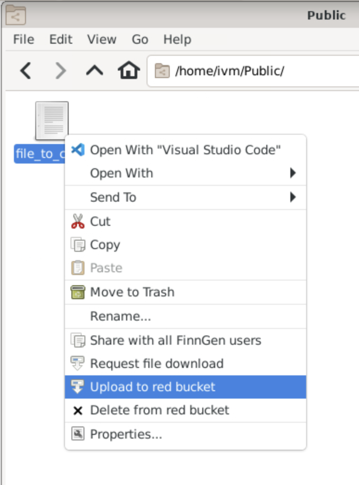
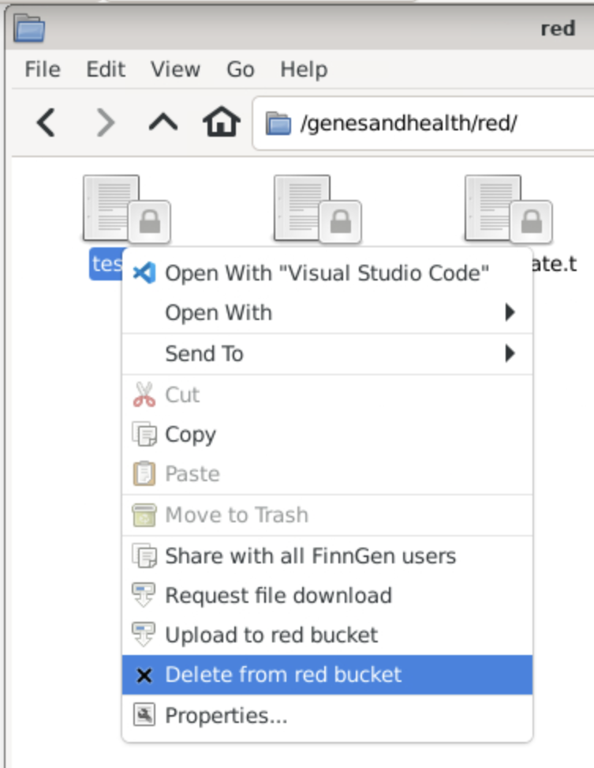

When you log into your sandboxes, you will have a number of folders available for you. 
To get started we will concentrate on the `home`, `library-red` and `red` folders.

This [reference page](../explainers/file_structure.md) goes through the other folder and explain what they are for and how they should be used. 

# Your Home Folder
Available at `/home/ivm` in your sandbox, this is your personal folder. You can use this to store any files you want to keep, but it is not backed up. If you delete a file from here, it is gone forever.

<!-- If you have access to multiple sandboxes, your `/home` folder will be accessible from all of them. -->

### Home Folder Uses
You can use your home folder for any files you want to keep, but it is not backed up. The best place for this is in your `red/` folder.

`/home/ivm` is semi-fast (HDD) storage and as such is faster than other parts of the sandbox. It might be worth it to run some jobs here especially if you are loading large amounts of data but you should be aware that this is not backed up and therefore anything you want to keep should be moved to the `red/` folder.

# Types of data sensitivity
Folders are suffixed with `red` or `green` to indicate the type of data that is stored there. Red is for potentially sensitive data that should not be shared without the outside world. Green is for data that can be shared with the outside world.

## library-red 
Available at `/genesandhealth/library-red` in your sandbox, this is a read-only folder that is shared between all users. This contains the data that you will want to use.

`library-red` is slower storage of large capacity (\>8 PiB @ Feb 2022). For large files, the whole file needs to be read and cached first by gcsfuse, fileseek to a certain part of the file is not possible. For high performance/large files it may be better to make a copy to `/genesandhealth/red` or `/home/ivm`.

`library-red` is a google storage bucket gs://qmul-sandbox-production-library-red/ (read+write only for admins)

`library-red` is where curated and raw data is stored. This is where you will find the data you need to run your analysis. There are a number of subfolders in `library-red` that contain different types of data, and each folder should be used for a specific purpose. If you find a folder that does not have a readme file, please contact the Genes and Health team to get more information on what the folder is for.

## red
`red` is used directly by the virtual machine, and is specific to each sandbox. Users in the same sandbox can all see the contents of the red folder. Most organisations use this folder to store their analyses.

`red` has slower storage than `/home/ivm` but is backed up, and we strongly recommend that you use this folder to store your data and any analysis files you are running frequently to avoid losing your work.

We strongly recommend that you make your own directory in the red folder to store your data. This will allow you to share your data with other users in the same sandbox, without the risk of them accidentally deleting it.

In the __Old TRE__ you can do this directly in the File Manager or on the Command Line.

In the __New TRE__, files can only be copied to the `red` bucket by right-clicking on the file and selecting `Upload to red bucket`.



This can also be done via `gsutil` from within the TRE, for example:

<div style="padding:0.5em;border:1px solid #000;border-radius:.1rem"><select style="display: block" onchange="this.nextElementSibling.firstChild.children[2].innerText='gsutil cp -r -n my_file gs://qmul-production-sandbox-'+this.value+'-red/'"><option value="1">Sandbox 1 - QMUL+WSI Core Team Desktop</option><option value="2">Sandbox 2 - External Academic Desktop</option><option value="3">Sandbox 3 - GSK Desktop</option><option value="4">Sandbox 4 - BMS Desktop</option><option value="5">Sandbox 5 - MSD Desktop</option><option value="6">Sandbox 6 - Takeda Desktop</option><option value="7">Sandbox 7 - Pfizer Desktop</option><option value="8">Sandbox 8 - S00050_FFAIR-PRS Desktop</option><option value="9">Sandbox 9 - Maze Therapeutics Desktop</option><option value="10">Sandbox 10 - Novo Nordisk Desktop</option><option value="11">Sandbox 11 - University of Exeter</option><option value="12">Sandbox 12 - Genomics PLC</option><option value="13">Sandbox 13 - AstraZeneca</option><option value="14">Sandbox 14 - External Academic, Consortium access</option><option value="15">Sandbox 15 - 5 Prime Sciences</option><option value="16">Sandbox 16 - Sandbox 16</option><option value="17">Sandbox 17 - Academic, NHS Digital access</option></select>

```
gsutil cp -r -n my_file "gs://qmul-production-sandbox-1-red/"
```

</div>

To remove a file from `/genesandhealth/red`, right-click on it in the File Manager and select `Delete from Red Bucket`.

